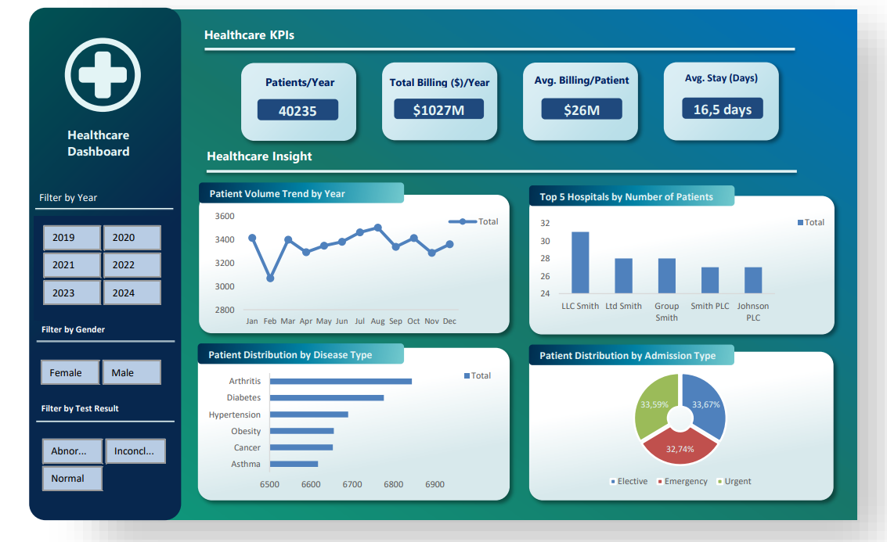

# Healthcare KPI Dashboard

This project aims to build a comprehensive healthcare performance dashboard using historical data from thousands of patients across multiple hospitals. It focuses on visualizing key performance indicators (KPIs) to deliver actionable insights into clinical and operational trends.

---

## Objectives (Healthcare KPIs)

1. **Total Patients per Year**  
   Calculates the number of patients registered each year to identify patient volume trends over time.

2. **Total Billing per Year**  
   Aggregates annual medical billing amounts as an indicator of financial load within the healthcare system.

3. **Average Billing per Patient per Year**  
   Measures the average cost per patient to evaluate the efficiency of healthcare services.

4. **Average Length of Stay (LoS) per Year**  
   Assesses hospital efficiency in handling patient care duration.

---

## Visualizations

1. **Vertical Bar Chart – Top 5 Hospitals by Number of Patients**  
   Displays the hospitals with the highest patient volumes.

2. **Horizontal Bar Chart – Disease Distribution**  
   Shows the number of cases per disease type to analyze prevalence.

3. **Line Chart – Patient Volume Trend by Year**  
   Visualizes annual changes in patient count.

4. **Pie Chart – Admission Type Distribution**  
   Illustrates the proportion of patients by admission type (Elective, Emergency, Urgent).

---

## Dashboard Preview

  
*Figure: Snapshot of the interactive healthcare dashboard.*

---

## Tools Used

- Microsoft Excel (Pivot Tables, Charts, Slicers)
- Git & GitHub (version control and project documentation)

---

## Dataset Description

The dataset includes anonymized patient data with the following fields:
- Admission Date
- Hospital Name
- Gender
- Disease/Diagnosis
- Billing Amount
- Admission Type
- Test Result

_Note: This project uses synthetic or publicly available healthcare data._

---

## Key Insights

- Patient volume has steadily increased over the years.
- Emergency admissions dominate the admission types.
- Diseases such as obesity and arthritis are the most common.
- The top five hospitals account for a significant share of patient volume.

---

## How to Use

1. Clone or download this repository.
2. Open the `healthcare_dashboard.xlsx` file.
3. Use the available slicers to interact with:
   - Year
   - Gender
   - Test Result
4. Explore the visualized KPIs and trends based on selected filters.

---

## Contact

If you have questions, suggestions, or would like to collaborate, feel free to connect via [LinkedIn](https://www.linkedin.com/in/aqilah-fedura-ilahi-899374339/) or open an issue in this repository.
